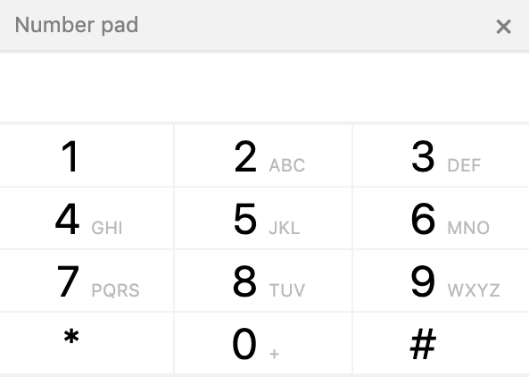

ember-telephone-keypad
==============================================================================

A simple 3x4 telephone keypad .

Installation
------------------------------------------------------------------------------

```
ember install ember-telephone-keypad
```


Usage
------------------------------------------------------------------------------

Place `{{keypad-component}}` where you need the keypad to be rendered.

The following parameters are available.
<ul>
  <li><code>title</code>: string - If you want to provide a title</li>
  <li><code>showClose</code>: boolean - If you want &times; to be displayed</li>
  <li><code>keypadCloseCallback</code>: action - This action will be called when &times; is clicked</li>
  <li><code>showDisplay</code>: boolean - An <code>input</code> where the pressed keys are displayed is rendered above the keypad</li>
  <li><code>focusDisplay</code>: boolean - The above <code>input</code> will be focussed on initial render</li>
  <li><code>targetDisplay</code>: selector - An <code>input</code> in your app to display the keys pressed</li>
  <li><code>targetEvent</code>: string - The event to dispatch from the above display on keypress</li>
  <li><code>keyPressCallback</code>: action - This action will be called with the key pressed</li>
</ul>


License
------------------------------------------------------------------------------

This project is licensed under the [MIT License](LICENSE.md).
